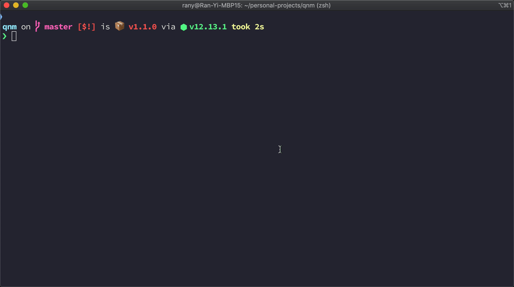

<p align=center>
  
  
  
  
  
  
</p>
<p align="center"></p>

<h2 align="center">🐚 cross-platform library to execute commands in a new shells</h2>

Sometimes a certain development environment requires more than a single terminal window, so you open a new one, or even better, split into multiple panes. This happens because nowadays, we have many interactive CLI apps that take the whole terminal window. In those cases, we'll see an explanation in the README that instructs us which commands should we run.

The main problem with this approach is that the developer is now required to understand multiple commands. Another problem is that we can't make sure that the developer will get the desired developer experience if it requires manual actions. For example, run a command, split panes in the terminal and then run another command.

**newsh** is here to solve these problems, it lets you configure how many terminal windows, tabs or splits you need and what commands to run in each one. It does its best effort to use features that your own terminal provides, like splitting panes. But worry not, in case a feature is not available, a regular terminal window is guaranteed to be opened.

## Features

- 👯‍♂️ Attempts to use the current terminal
- 🌏 Cross-platform
- 📄 Runs js files with node
- 🗃 Opens the new shell in current working directory
- 🎛 Supports spliting (`iterm2`/`tmux`)
- 🌴 Pass environment parameters to the new shell instance

## Installation

You can choose to install using `yarn` or `npm`

```sh
yarn add --dev newsh
```

```sh
npm install -D newsh
```

In case you want the `newsh` command to be available globally:

```sh
yarn global add newsh
```

```sh
npm install newsh --global
```

## CLI

#### Run a command in a new shell

> prints "hello world" in a new shell window

```sh
newsh "echo 'hello world'"
```

> The new shell will run in the same working directory.

```sh
# See for yourself 👀

newsh pwd
```

> You can run multiple shells

```sh
newsh "tsc --watch" "jest --watch"
```

> Note that you can use `tsc`, `jest` and any other local bin just like in npm/yarn scripts

### --split-horizontally

Attempts to split the screen horizontally instead of opening a new tab/window

```sh
newsh --split-horizontally "say down"
```

### --split-vertically

Attempts to split the screen vertically instead of opening a new tab/window

```sh
newsh --split-vertically "say right"
```

### --split

Alias for `--split-vertically`

<p align="center"></p>

### --terminalApp

Choose a specific terminal app to use (e.g. `iTerm.app`)

### --file

Executes a file in a new shell

```sh
newsh --file "./script.sh"
```

> Supports running node for javascript files

```sh
newsh --file "./script.js"
```

## Node API

> possible options for the command and file methods

```ts
type Options = {
  env?: Record<string, string> = {};
  cwd?: string = process.cwd();
  cd?: string = process.cwd();
  split?: boolean = false;
  splitDirection?: "vertically" | "horizontally" = "vertically";
  terminalApp?: string | undefined = $TERM_PROGRAM;
};
```

### command

> Run a command in a new shell

```ts
command(script: string, options: Options): void
```

### file

> Executes a file in a new shell

```ts
file(scriptPath: string, options: Options): void
```

## Development

```sh
# install
yarn
# compile
yarn watch
# test
yarn test
```

## Contributing

If you find a bug or want this project to provide better support for a certain terminal application, please open an issue. You are more than welcome to create pull requests as well.

## Future

- Controll the focus of the terminal window
- Better `split` integration with other terminals (`hyper`, `conEmu` and more)
