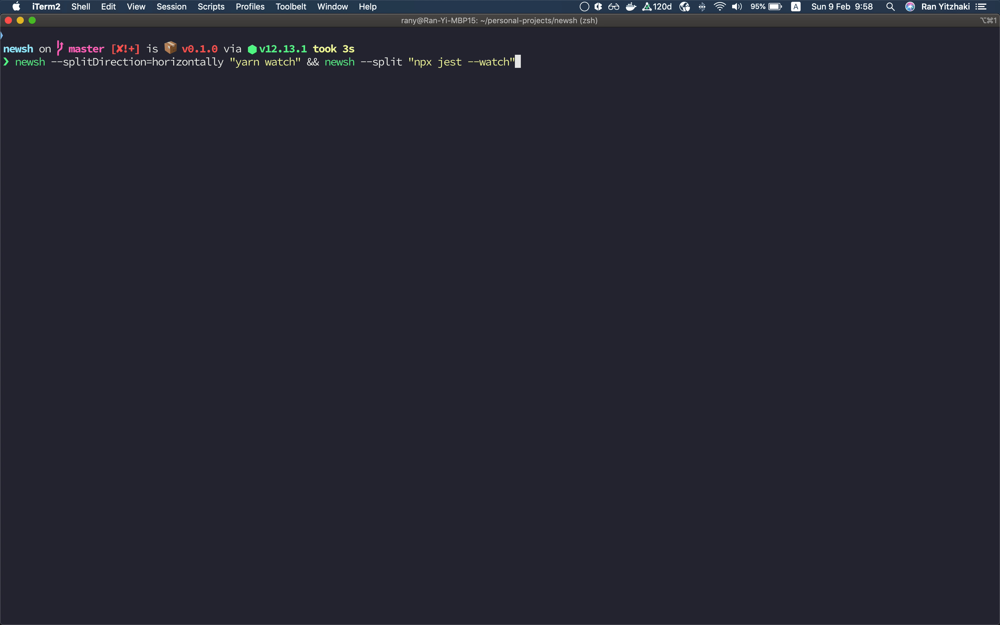

<p align="center"></p>

<h2 align="center">🐚 cross-platform library to execute commands in a new shells</h2>

> When you have many cli apps that takes the whole terminal, it's useful to run them all with a single command

## Features

- 👯‍♂️ Attempts to use the current terminal
- 🌏 Cross-platform
- 📄 Runs js files with node
- 🗃 Opens the new shell in current working directory
- 🎛 Supports spliting with `iterm2` & `tmux`

## CLI

#### Run a command in a new shell

> prints "hello world" in a new shell window

```sh
newsh "echo 'hello world'"
```

> The new shell will run in the same working directory.

```sh
# See for yourself 👀

newsh pwd
```

> You can run multiple shells

```sh
newsh "npx tsc --watch" "npx jest --watch"
```

### --split-horizontally

Attempts to split the screen horizontally instead of opening a new tab/window

```sh
newsh --split-horizontally "echo hello"
```

### --split-vertically

Attempts to split the screen vertically instead of opening a new tab/window

```sh
newsh --split-vertically "echo hello"
```

### --split

Alias for `--split-vertically`

### --terminalApp

Choose a specific terminal app to use (e.g. `iTerm.app`)

### --file

Executes a file in a new shell

```sh
newsh --file "./script.sh"
```

> Supports running node for javascript files

```sh
newsh --file "./script.js"
```

## Node API

> possible options for the command and file methods

```ts
type Options = {
  env?: Record<string, string> = {};
  split?: boolean = false;
  splitDirection?: "vertically" | "horizontally" = "vertically";
  terminalApp?: string | undefined = $TERM_PROGRAM;
};
```

### command

> Run a command in a new shell

```ts
command(script: string, options: Options): void
```

### file

> Executes a file in a new shell

```ts
file(scriptPath: string, options: Options): void
```

## Future

- Run npm scripts in a new terminal (and resolve bins from the `node_modules/.bin` directory)
- Controll the focus of the terminal window
- Pass environment parameters from the CLI
- Manage IPC with the other terminal window (similar to `child_process.fork`)

<p align="left"><p/>
